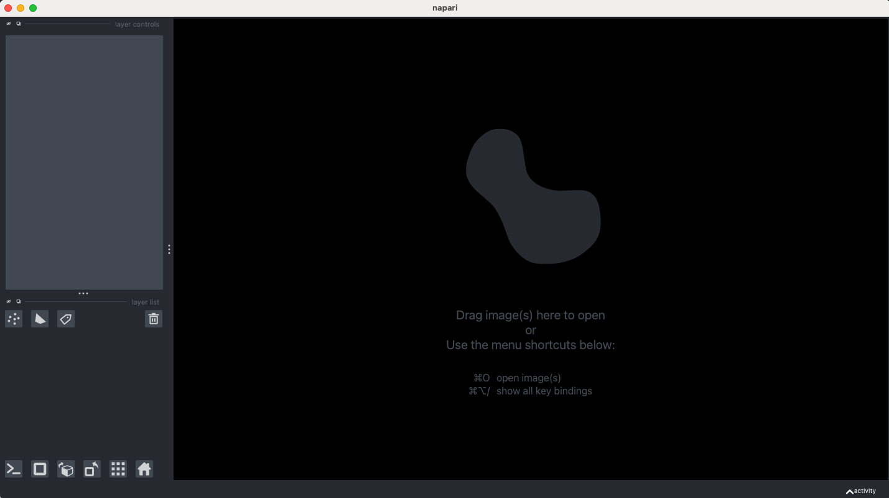
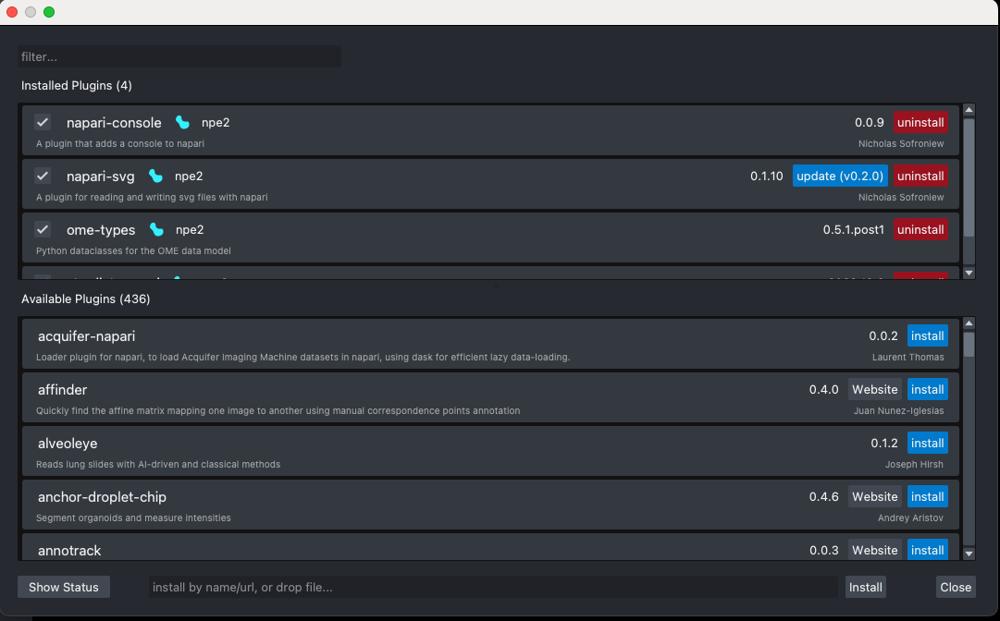
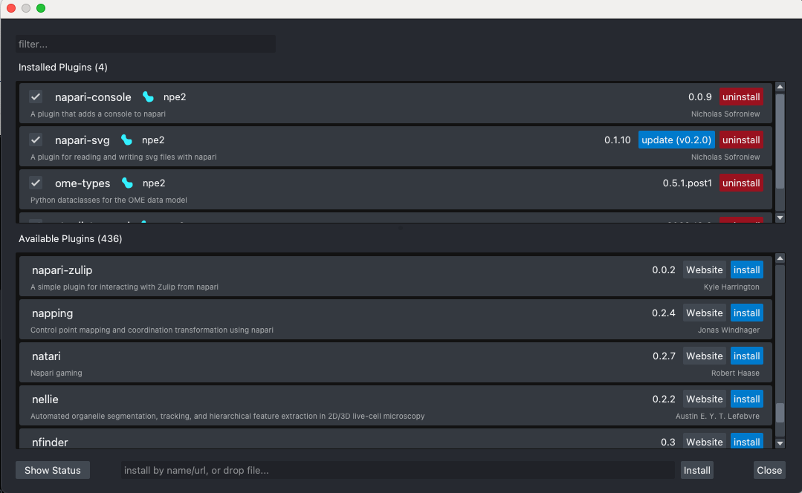
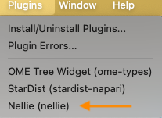
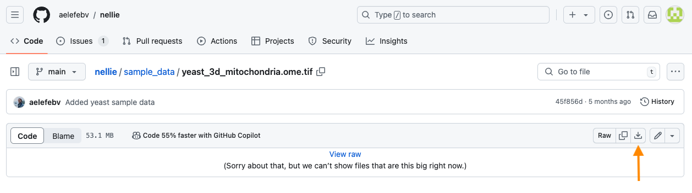
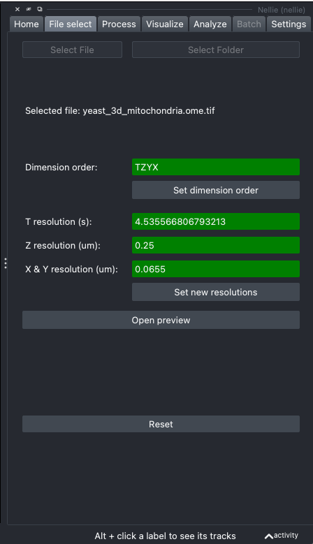

# JC20240807: Setting up Nellie

1. I hope you've installed Anaconda by now. If you haven't, please click [here](https://www.anaconda.com/download/success) to download it.

2. After installing Anaconda, open your Terminal. If you're a Mac/Linux user and you can't find Terminal, search for it in your Applications folder. If you're a Windows user, download [Windows Terminal](https://apps.microsoft.com/detail/9n0dx20hk701?hl=en-us&gl=US) from the Microsoft store. 

3. In your terminal, copy and paste the code below and hit "Enter" to create a new environment and install Napari:
```bash
conda create -y -n napari-env -c conda-forge python=3.10
```

4. After installation, copy and paste the code below into your terminal and hit "Enter" to activate the environment:
```bash
conda activate napari-env
```
5. After the environment is activated, type `napari` in your terminal and hit "Enter" to open it. A Napari window should pop up:


6. Next, go to `Plugins > Install/Uninstall Plugins`. You should see a window like this:


7. Look for Nellie under "Available Plugins". After you find it, click "install":


8. After Nellie is installed, close all Napari windows, type `napari` in your terminal, and hit "Enter" to restart Napari.

9. Activate Nellie by clicking `Plugins > Nellie`:



10. Download the demo image [here](https://github.com/aelefebv/nellie/blob/main/sample_data/yeast_3d_mitochondria.ome.tif):



11. Go back to the Napari window, then go to `File select` tab, and click `Select File` to select the file you just downloaded. You should see something like this after you select the file:



12. Go to the `Process` tab and click `Run Nellie`. This will take a minute.

13. After Nellie finishes running, go to the `Visualize` tab to visualize results or the `Analyze` tab to see the quantitative data.
