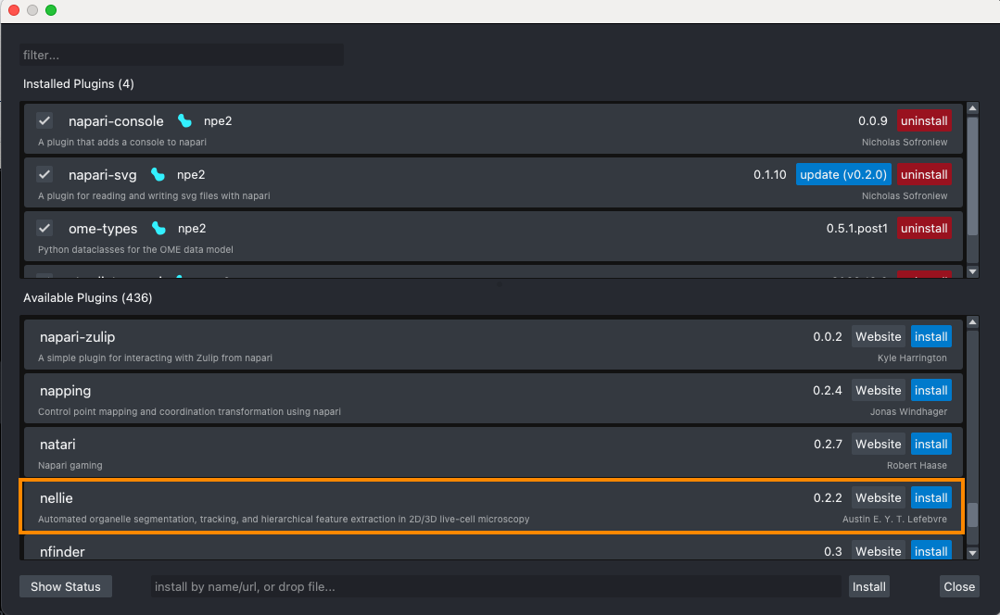

# JC20240807: Setting up Nellie

## Step 1:
I hope you've installed Anaconda by now. If you haven't, please click [here](https://www.anaconda.com/download/success) to download it.

## Step 2:
After installing Anaconda, open your terminal. If you're a Mac/Linux user and you can't find terminal, search for it in your Application folder. If you're a Windows user, download [Windows terminal](https://apps.microsoft.com/detail/9n0dx20hk701?hl=en-us&gl=US) from the Microsoft store. 

In your terminal, copy and paste the code below to your terminal and hit "Enter" to create a new environment and install Napari:
```bash
conda create -y -n napari-env -c conda-forge python=3.10
```
## Step 3:
After the installation is done, copy and paste the code below to your terminal and hit "Enter" to activate the environment:
```bash
conda activate napari-env
```
After the environment is activated, type `napari` in your terminal and hit "Enter" to open it. A Napari window should pop up:


Next, go to `Plugins > Install/Uninstall Plugins`. You should see a window like this:


Look for Nellie under "Available Plugins". After you found it, click "install":


After Nellie is installed, close all Napari windows, type `napari` in your terminal, and hit "Enter" to restart Napari.

## Step 4:
Activate Nellie by clicking `Plugins > Nellie`:

